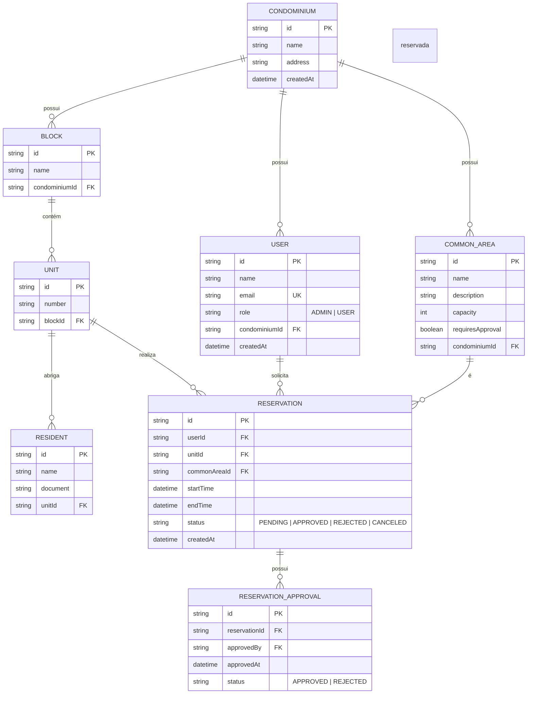

# 📐 Software Design Document (SDD) - Reserva Aí!

**Projeto:** Reserva Aí! (Gestão de Condomínios e Áreas Comuns)
**Versão:** 2.0.0
**Status:** 🟢 Pronto para Implementação
**Stack Principal:** NestJS, React, Prisma ORM, PostgreSQL.

---

## 🏗️ 1. Arquitetura do Sistema (Estrutura Monorepo)

O projeto utiliza uma arquitetura de Monorepo.

* **`apps/api`**: Backend (NestJS) → `Module` → `Controller` → `Service` → `Prisma`
* **`apps/web`**: Frontend (React)
* **`apps/extension`**: (Opcional futuro)

---

## 🤖 2. Orquestração e Contexto de IA (MCP)

* **Database MCP:** Prisma + PostgreSQL
* **GitHub MCP:** Integração com Issues (TDD)
* **OpenAPI Context:** Geração automática de DTOs e Controllers

---

## 📦 3. Stack Tecnológica

* **Backend:** NestJS 10+
* **ORM:** Prisma
* **Auth:** JWT + Passport
* **Validação:** class-validator + class-transformer
* **Docs:** Swagger

---

## 🗄️ 4. Arquitetura de Dados

### 📖 4.1. Glossário Técnico

| Termo      | Entidade    | Atributos              |
| ---------- | ----------- | ---------------------- |
| Usuário    | User        | id, name, email, role  |
| Condomínio | Condominium | id, name               |
| Área Comum | CommonArea  | id, name, capacity     |
| Reserva    | Reservation | id, startTime, endTime |

---

### 🗄️ 4.2. Modelagem de Dados

---

## 📑 5. Contratos Globais (DTOs)

* **AuthDTO:** `{ email: string, password: string }`
* **CreateUserDTO:** `{ name: string, email: string, password: string }`
* **CreateCondominiumDTO:** `{ name: string, address: string }`
* **CreateCommonAreaDTO:** `{ name: string, capacity: number, requiresApproval: boolean }`
* **CreateReservationDTO:** `{ commonAreaId: string, startTime: Date, endTime: Date }`

---

## 🏗️ 6. Estrutura Backend

### 📂 Módulos

* `auth`
* `users`
* `condominiums`
* `common-areas`
* `reservations`

---

## 🧠 Core Services

| Service            | Função             |
| ------------------ | ------------------ |
| PrismaService      | Acesso ao banco    |
| AuthService        | Login/JWT          |
| ReservationService | Regras de conflito |

---

## 🛡️ 7. Segurança

* JWT (8h)
* Guards por role (ADMIN/USER)
* ValidationPipe (whitelist)

---

## 📡 8. API

### 🔐 Auth

* POST `/auth/login`

### 🏢 Condomínios

* POST `/condominiums`
* GET `/condominiums`

### 🏊 Áreas

* POST `/common-areas`
* GET `/common-areas`

### 📅 Reservas

* POST `/reservations`
* GET `/reservations`
* DELETE `/reservations/:id`

---

## 🛡️ Regras de Negócio (Implementação Técnica)

* Verificar conflito de horário antes de criar reserva
* Apenas dono ou admin pode cancelar
* Admin pode aprovar reservas
