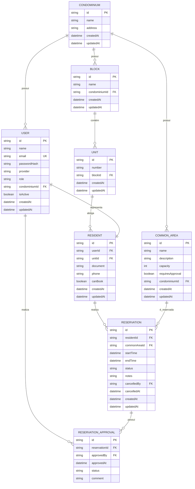

# 📐 Software Design Document (SDD) - Reserva Aí!

**Projeto:** Reserva Aí! (Gestão de Condomínios e Áreas Comuns)
**Versão:** 2.0.0
**Status:** 🟢 Pronto para Implementação
**Stack Principal:** NestJS, VueJS, Prisma ORM, PostgreSQL.

---

## 🏗️ 1. Arquitetura do Sistema (Estrutura Monorepo)

O projeto utiliza uma arquitetura de Monorepo.

* **`apps/api`**: Backend (NestJS) → `Module` → `Controller` → `Service` → `Prisma`
* **`apps/web`**: Frontend (VueJS)
* **`apps/extension`**: (Opcional futuro)

---

## 🤖 2. Orquestração e Contexto de IA (MCP)
> Configuração dos contextos Model Context Protocol para que o Agente da IDE entenda as fronteiras e regras do backend.

* **Database MCP (Neon.tech):** Contexto do esquema PostgreSQL real via Prisma Introspection.
* **GitHub MCP:** Leitura das **Issues** do repositório para orientar o fluxo **TDD (Test-Driven Development)** e fechamento automático de tarefas.
* **OpenAPI Context:** Instrução para que o Agente gere Controllers e DTOs respeitando rigorosamente os contratos da Seção 4.

---

## 📦 3. Stack Tecnológica

* **Backend:** NestJS 10+
* **ORM:** Prisma (PostgreSQL) - Interface oficial com o banco de dados.
* **Auth:** Passport.js + JWT (JSON Web Tokens) para sessões seguras.
* **Documentação:** `@nestjs/swagger` (OpenAPI 3.0 para ID12).
* **Validação:** class-validator + class-transformer
---

## 🗄️ 4. Arquitetura de Dados

### 📖 4.1. Glossário Técnico / Dicionário de Entidades

---

#### **USER**
**Descrição:**  
Representa a conta de acesso ao sistema. É a entidade responsável pela autenticação, identificação do usuário e controle de permissões.

| Coluna | Tipo | Obrigatório | Descrição |
| :--- | :--- | :--- | :--- |
| `id` | UUID | Sim | Identificador único do usuário. |
| `name` | VARCHAR(120) | Sim | Nome completo do usuário. |
| `email` | VARCHAR(150) | Sim | E-mail único utilizado para login no sistema. |
| `passwordHash` | VARCHAR(255) | Não | Senha criptografada do usuário (caso o login seja local). |
| `provider` | ENUM | Sim | Provedor de autenticação (`LOCAL`, `GOOGLE`). |
| `role` | ENUM | Sim | Perfil de acesso do usuário (`SUPER_ADMIN`, `ADMIN`, `RESIDENT`). |
| `condominiumId` | UUID | Não | Referência ao condomínio. (Pode ser nulo caso o usuário seja um `SUPER_ADMIN`). |
| `isActive` | BOOLEAN | Sim | Indica se a conta está ativa (usado para inativação/pausa pelo Super Admin). |
| `createdAt` | DATETIME | Sim | Data e hora de criação do registro. |
| `updatedAt` | DATETIME | Sim | Data e hora da última atualização. |

---

#### **CONDOMINIUM**
**Descrição:**  
Representa o condomínio onde o sistema será utilizado. Um condomínio agrupa blocos, unidades, moradores e áreas comuns.

| Coluna | Tipo | Obrigatório | Descrição |
| :--- | :--- | :--- | :--- |
| `id` | UUID | Sim | Identificador único do condomínio. |
| `name` | VARCHAR(150) | Sim | Nome do condomínio. |
| `address` | VARCHAR(255) | Sim | Endereço principal do condomínio. |
| `createdAt` | DATETIME | Sim | Data e hora de criação do registro. |
| `updatedAt` | DATETIME | Sim | Data e hora da última atualização. |

---

#### **BLOCK**
**Descrição:**  
Representa um bloco, torre ou setor dentro de um condomínio.

| Coluna | Tipo | Obrigatório | Descrição |
| :--- | :--- | :--- | :--- |
| `id` | UUID | Sim | Identificador único do bloco. |
| `name` | VARCHAR(50) | Sim | Nome ou identificação do bloco. |
| `condominiumId` | UUID | Sim | Referência ao condomínio ao qual o bloco pertence. |
| `createdAt` | DATETIME | Sim | Data e hora de criação do registro. |
| `updatedAt` | DATETIME | Sim | Data e hora da última atualização. |

---

#### **UNIT**
**Descrição:**  
Representa uma unidade residencial do condomínio, como apartamento, casa ou sala.

| Coluna | Tipo | Obrigatório | Descrição |
| :--- | :--- | :--- | :--- |
| `id` | UUID | Sim | Identificador único da unidade. |
| `number` | VARCHAR(20) | Sim | Número ou identificação da unidade. |
| `blockId` | UUID | Sim | Referência ao bloco ao qual a unidade pertence. |
| `createdAt` | DATETIME | Sim | Data e hora de criação do registro. |
| `updatedAt` | DATETIME | Sim | Data e hora da última atualização. |

---

#### **RESIDENT**
**Descrição:**  
Representa o morador vinculado a uma unidade residencial. É uma extensão do usuário, contendo os dados do morador no contexto do condomínio.

| Coluna | Tipo | Obrigatório | Descrição |
| :--- | :--- | :--- | :--- |
| `id` | UUID | Sim | Identificador único do morador. |
| `userId` | UUID | Sim | Referência ao usuário que realiza login no sistema. |
| `unitId` | UUID | Sim | Referência à unidade residencial do morador. |
| `document` | VARCHAR(20) | Não | Documento identificador do morador (CPF/RG, se aplicável). |
| `phone` | VARCHAR(20) | Não | Telefone de contato do morador. |
| `canBook` | BOOLEAN | Sim | Indica se o morador possui permissão para realizar reservas. |
| `createdAt` | DATETIME | Sim | Data e hora de criação do registro. |
| `updatedAt` | DATETIME | Sim | Data e hora da última atualização. |

---

#### **COMMON_AREA**
**Descrição:**  
Representa uma área comum disponível para uso no condomínio, como salão de festas, churrasqueira, piscina ou quadra.

| Coluna | Tipo | Obrigatório | Descrição |
| :--- | :--- | :--- | :--- |
| `id` | UUID | Sim | Identificador único da área comum. |
| `name` | VARCHAR(120) | Sim | Nome da área comum. |
| `description` | TEXT | Não | Descrição complementar da área. |
| `capacity` | INT | Não | Capacidade máxima de pessoas permitidas. |
| `requiresApproval` | BOOLEAN | Sim | Indica se a reserva exige aprovação administrativa. |
| `condominiumId` | UUID | Sim | Referência ao condomínio ao qual a área pertence. |
| `createdAt` | DATETIME | Sim | Data e hora de criação do registro. |
| `updatedAt` | DATETIME | Sim | Data e hora da última atualização. |

---

#### **RESERVATION**
**Descrição:**  
Representa uma solicitação ou agendamento de uso de uma área comum por um morador.

| Coluna | Tipo | Obrigatório | Descrição |
| :--- | :--- | :--- | :--- |
| `id` | UUID | Sim | Identificador único da reserva. |
| `residentId` | UUID | Sim | Referência ao morador responsável pela reserva. |
| `commonAreaId` | UUID | Sim | Referência à área comum reservada. |
| `startTime` | DATETIME | Sim | Data e hora de início da reserva. |
| `endTime` | DATETIME | Sim | Data e hora de término da reserva. |
| `status` | ENUM | Sim | Status da reserva (`PENDING`, `APPROVED`, `REJECTED`, `CANCELED`). |
| `notes` | TEXT | Não | Observações adicionais da reserva. |
| `cancelledBy` | UUID | Não | Referência ao usuário (Admin ou Morador) que cancelou a reserva. |
| `cancelledAt` | DATETIME | Não | Data e hora em que a reserva foi cancelada. |
| `createdAt` | DATETIME | Sim | Data e hora de criação do registro. |
| `updatedAt` | DATETIME | Sim | Data e hora da última atualização. |

---

#### **RESERVATION_APPROVAL**
**Descrição:**  
Representa o histórico de aprovação ou rejeição de reservas que exigem validação administrativa.

| Coluna | Tipo | Obrigatório | Descrição |
| :--- | :--- | :--- | :--- |
| `id` | UUID | Sim | Identificador único do registro de aprovação. |
| `reservationId` | UUID | Sim | Referência à reserva analisada. |
| `approvedBy` | UUID | Sim | Referência ao usuário administrador responsável pela decisão. |
| `approvedAt` | DATETIME | Sim | Data e hora da aprovação ou rejeição. |
| `status` | ENUM | Sim | Resultado da análise (`APPROVED`, `REJECTED`). |
| `comment` | TEXT | Não | Observação ou justificativa da decisão. |

---

### 🗄️ 4.2. Modelagem de Dados



---
## 📑 5. Contratos Globais (DTOs & Interfaces)

Os contratos globais representam os principais objetos de entrada e saída esperados pela API. Esses contratos serão implementados no backend como DTOs (Data Transfer Objects), garantindo validação, consistência e previsibilidade nas operações.

---

### 🔐 AuthDTO
Utilizado no processo de autenticação de usuários.

```ts
{
  email: string;
  password: string;
}
```

---

### 🏢 RegisterTenantDTO (Self-Service Onboarding)
Utilizado na rota pública `/auth/register` incial. Cria o Condomínio e o Administrador raiz simultaneamente em uma única transação no banco (ACID).

```ts
{
  condominiumName: string;
  condominiumAddress: string;
  adminName: string;
  adminEmail: string;
  adminPassword: string;
}
```

---

### 👤 CreateResidentUserDTO
Utilizado pelo Administrador na rota restrita para "cadastrar" um morador em seu condomínio. O backend forçará o `condominiumId` do Admin logado nesta operação.

```ts
{
  name: string;
  email: string;
  password?: string; // Opcional: pode ser gerada aleatoriamente
  unitId: string;
  document?: string;
  phone?: string;
  canBook: boolean;
}
```

---

### 🧱 CreateBlockDTO
Utilizado para cadastro de blocos ou torres dentro de um condomínio.

```ts
{
  name: string;
  condominiumId: string;
}
```

---

### 🚪 CreateUnitDTO
Utilizado para cadastro de unidades residenciais.

```ts
{
  number: string;
  blockId: string;
}
```

---

### 🏊 CreateCommonAreaDTO
Utilizado para cadastro de áreas comuns.

```ts
{
  name: string;
  description?: string;
  capacity?: number;
  requiresApproval: boolean;
  condominiumId: string;
}
```

---

### 📅 CreateReservationDTO
Utilizado para criação de reservas de áreas comuns.

```ts
{
  commonAreaId: string;
  startTime: Date;
  endTime: Date;
  notes?: string;
}
```

---

### ✅ CreateReservationApprovalDTO
Utilizado para registrar a aprovação ou rejeição de reservas pendentes.

```ts
{
  reservationId: string;
  status: 'APPROVED' | 'REJECTED';
  comment?: string;
}
```

---

## 🏗️ 6. Estrutura Backend

A aplicação backend será organizada de forma modular, seguindo uma arquitetura orientada a domínio, com separação clara entre autenticação, entidades de negócio, regras operacionais e infraestrutura.

### 📂 Módulos Principais

- `auth`
- `users`
- `residents`
- `condominiums`
- `blocks`
- `units`
- `common-areas`
- `reservations`
- `reservation-approvals`

---

### 🧠 Core Services

| Service | Função |
| :--- | :--- |
| `PrismaService` | Responsável pela comunicação com o banco de dados. |
| `AuthService` | Responsável pela autenticação, login e emissão de tokens. |
| `UsersService` | Gerencia contas de acesso do sistema. |
| `ResidentsService` | Gerencia o perfil de morador e seu vínculo com unidades. |
| `CondominiumsService` | Gerencia condomínios cadastrados. |
| `CommonAreasService` | Gerencia áreas comuns disponíveis para reserva. |
| `ReservationsService` | Gerencia criação, cancelamento, consulta e validação de reservas. |
| `ReservationApprovalsService` | Gerencia aprovações administrativas de reservas pendentes. |

---

### 🧱 Camadas Técnicas Previstas

- **Controllers:** exposição dos endpoints REST.
- **Services:** regras de negócio e orquestração das operações.
- **DTOs:** validação e padronização dos contratos de entrada e saída.
- **Guards:** proteção de rotas e controle de acesso por perfil.
- **Prisma ORM:** persistência e mapeamento relacional.
- **Middlewares / Interceptors / Filters:** tratamento transversal da aplicação.

---

## 🛡️ 7. Segurança

A camada de segurança do sistema deverá garantir autenticação confiável, autorização por perfil e proteção das rotas sensíveis da aplicação.

### Diretrizes Técnicas

- **Autenticação:** JWT com tempo de expiração configurável.
- **Validação de acesso:** Guards por perfil (`ADMIN`, `RESIDENT`).
- **Validação de payload:** uso de `ValidationPipe` com `whitelist`.
- **Criptografia de senha:** hashing seguro para autenticação local.
- **Proteção de rotas:** acesso restrito conforme papel do usuário.
- **Controle de sessão:** invalidação lógica por status de usuário, quando necessário.

### Regras de Segurança

- Apenas usuários autenticados podem acessar funcionalidades protegidas.
- Apenas administradores podem cadastrar e gerenciar estruturas do condomínio.
- Apenas moradores autorizados podem realizar reservas.
- Apenas o autor da reserva ou administradores podem cancelar reservas.
- Reservas pendentes de aprovação só podem ser aprovadas por administradores.

---

## 📡 8. Documentação da API (OpenAPI / Swagger)

A API REST do sistema será documentada utilizando o padrão **OpenAPI 3.x**, com interface navegável via **Swagger UI**.

Essa abordagem substitui a simples listagem de rotas, oferecendo uma especificação técnica mais completa para desenvolvimento, testes, integração e apoio à construção assistida por IA.

---

### 🎯 Objetivos da Documentação

- centralizar a descrição dos endpoints da API;
- explicitar os contratos de entrada e saída;
- facilitar testes e validação;
- melhorar a integração entre frontend e backend;
- reduzir ambiguidades de implementação.

---

### 🔐 Agrupamentos de Endpoints

A API será organizada nos seguintes grupos funcionais:

- **Auth**
- **Users**
- **Residents**
- **Condominiums**
- **Blocks**
- **Units**
- **Common Areas**
- **Reservations**
- **Reservation Approvals**

---

### 📘 Exemplos de Endpoints Esperados

#### **Auth**
- `POST /auth/login`
- `POST /auth/register` (Exclusiva para registrar Condomínio + Admin via `RegisterTenantDTO`)

#### **Users**
- `GET /users`
- `GET /users/:id`
- `PATCH /users/:id`
- `PATCH /users/:id/status`

#### **Residents**
- `POST /residents`
- `GET /residents`
- `GET /residents/:id`

#### **Condominiums**
- `POST /condominiums`
- `GET /condominiums`
- `GET /condominiums/:id`
- `PATCH /condominiums/:id`

#### **Blocks**
- `POST /blocks`
- `GET /blocks`
- `GET /blocks/:id`

#### **Units**
- `POST /units`
- `GET /units`
- `GET /units/:id`

#### **Common Areas**
- `POST /common-areas`
- `GET /common-areas`
- `GET /common-areas/:id`
- `PATCH /common-areas/:id`

#### **Reservations**
- `POST /reservations`
- `GET /reservations`
- `GET /reservations/:id`
- `PATCH /reservations/:id/cancel`

#### **Reservation Approvals**
- `POST /reservation-approvals`
- `GET /reservation-approvals/:id`

---

### 📥 Exemplo de Contrato de Entrada

#### `POST /reservations`

**Request Body**
```json
{
  "commonAreaId": "uuid",
  "startTime": "2026-03-27T18:00:00.000Z",
  "endTime": "2026-03-27T22:00:00.000Z",
  "notes": "Reserva para confraternização familiar."
}
```

**Response 201**
```json
{
  "id": "uuid",
  "residentId": "uuid",
  "commonAreaId": "uuid",
  "status": "PENDING",
  "startTime": "2026-03-27T18:00:00.000Z",
  "endTime": "2026-03-27T22:00:00.000Z",
  "createdAt": "2026-03-27T10:00:00.000Z"
}
```

---

### 📤 Códigos de Resposta Esperados

| Código | Significado |
| :--- | :--- |
| `200` | Operação realizada com sucesso |
| `201` | Recurso criado com sucesso |
| `400` | Dados inválidos na requisição |
| `401` | Usuário não autenticado |
| `403` | Usuário sem permissão |
| `404` | Recurso não encontrado |
| `409` | Conflito de reserva ou regra de negócio |
| `500` | Erro interno do servidor |

---

## 🛡️ 9. Regras de Negócio (Implementação Técnica)

As regras de negócio abaixo representam comportamentos que deverão ser garantidos pela camada de serviço da aplicação.

- O isolamento de dados (Tenant) deve ser aplicado via `condominiumId` em TODAS as listagens e criações (injetado automaticamente pelo JWT da requisição).
- **Cadastro Fechado para Moradores:** A rota pública `/auth/register` é exclusiva para Síndicos criarem novos condomínios de forma autônoma. Moradores são cadastrados por rotas autenticadas, exclusivamente sob intermédio de um Administrador.
- O perfil `SUPER_ADMIN` (apesar de existir no banco) atua de forma "headless" neste MVP, sem telas exclusivas para não gerar fuga de escopo (útil apenas para intervenção via DB/terminal).
- Verificar conflito de horário (exclusividade) antes da reserva da área comum.
- Impedir reservas para áreas inativas.
- Validar se o morador possui `canBook = true`.
- Permitir Soft Cancel ao autor da reserva ou administradores, preenchendo as colunas de auditoria na tabela.
- Criar reservas com status `PENDING` quando a área exigir aprovação.
- Criar reservas com status `APPROVED` automaticamente quando a área não exigir aprovação.
- Permitir aprovação ou rejeição apenas por administradores do mesmo condomínio.
- Registrar histórico de aprovação e cancelamentos para fins de rastreabilidade.
- Garantir a integridade do escopo do condomínio entre usuário, morador, unidade e área comum.